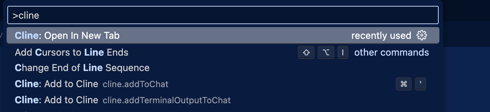
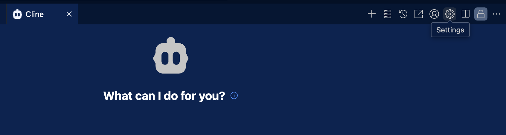
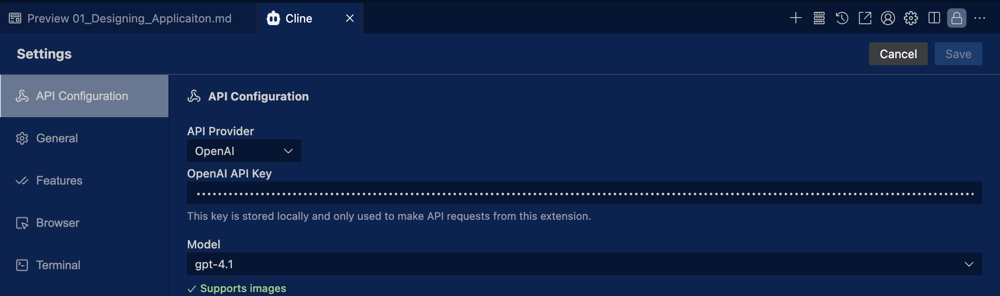

# Chapter1: Designing application

If you haven't completed [Prepartion](../../01_Preparation.md), please completes the preparation to install all tools we need in this chapter.

## Relevant PRs

You can find all commits for this chapter in the following PRs.

- https://github.com/takanabe/ai-lab/pull/2 

## Overview

Large Language Models (LLMs) are powerful, but they cannot consistently produce high-quality or accurate results without detailed and structured context. Without clear instructions, architecture, or coding standards, their output can be vague, inconsistent, or misaligned with your goals.

To address this, we introduce [Cline](https://github.com/cline/cline), an AI agent framework integrated into **VSCode**. Cline allows you to work with LLMs in a development environment using two modes:
- **Plan**: Ask the agent to think and draft content
- **Act**: Direct the agent to perform concrete actions like saving files or updating documentation

As part of this workflow, you’ll define and share project-specific context using the `.clinerules` directory. This directory holds markdown files that document your architecture, coding policies, and development tasks. These files act as persistent memory that the AI agent can refer to throughout the project.

By the end of this chapter, you’ll have:
- A clearly defined architecture
- Coding policies
- A granular, testable task list for MVP development

All of this is made possible by collaborating with an AI agent that understands your context through `.clinerules`.

## What you'll do

- You will experience how to use "Plan" and "Act" in Cline.
- You will create a project structure, coding policy, and tasks as markdown files.
- You will share the markdown files as our application contexts with AI Agent.


## 1-1: Initializing project

Please create a new directory and initialize git before you start working AI-driven development.

Following commands are examples to prepare the project directory.

```bash
cd [SOMEWHERE_YOU_CAN_CREATE_YOUR_DIRECTORY]
mkdir recipe-app && cd recipe-app
git init
echo "Recipe App" > README.md
git add . && git commit -m "initial commit"
```

Let's open VSCode with the command below at the repository root

```
code .
```

If you haven't configured `code` command yet, please check [Preparation](../../01_Preparation.md) document and setup the command to use from you terminal.

## 1-2: Introducing Cline


Explaining the full details of Cline takes time. This workshop avoids deep-diving into Cline's documentation and instead focuses on giving you the essential knowledge needed to guide an AI agent effectively using Cline. If you'd like to learn more about Cline in detail after the workshop, visit https://docs.cline.bot.

Anyways, Let's configure Cline! First of all, please open the Cline window using VSCode Command Palette. You can access the VSCode Command Palette in a number of ways. Shift + Command + P (Mac) / Ctrl + Shift + P (Windows/Linux).



Next, open setting of Cline.



The only configuration we need is choosing API provider, model, and passing API key. This time, we will use OpenAI as API Provider and it's model `gpt-4.1` for the LLM. Also don't forget to put API key you have.



That's it! From now, your VSCode can work with AI Agent.

## 1-3: Designing project structure

Run the following prompt with "Plan" mode.

```
I’m building a cooking receipe sharing application that people register their own recipes and share with other users. Use Next.js and Material UI (UI) for frontend, Supabase for DB + auth.

Give me the full architecture:
- File + folder structure
- What each part does
- Where state lives, how services connect

Format this entire document in markdown.
```

Run the prompt below with "Act" mode.

```
save this document as a markdown as .clinerules/01_architecture.md
```

## 1-4: Creating coding policy

Run the following prompt with "Plan" mode.

```
Add .clinerules/02_coding_policy.md for code practice in this project. I'd like to follow TDD approach and have unit tests and E2Es.
```

Change the mode from Plan to Act and save the file.


## 1-5: Creating a task list

Run the following prompt with "Plan" mode.

```
Using that @/.clinerules/01_architecture.md and @/.clinerules/02_coding_policy.md , write a granular step-by-step plan to build the MVP. 

Each task should: 
- Be incredibly small + testable
- Have a clear start + end
- Focus on one concern 

I’ll be passing this off to an engineering LLM that will be told to complete one task at a time, allowing me to test in between. 
```

Change the mode from Plan to Act and save the file.


## Conclusion

In this chapter, you designed the foundation of an AI-driven application by working collaboratively with an LLM agent. You learned how to structure context through markdown files, guide the model using Plan and Act modes, and align AI output with your specific development goals.

While this chapter introduced **Cline** as the agent interface inside VSCode, the key takeaway is not the tool itself, but the **approach**: providing structured context, iterating with reasoning, and treating the AI as a collaborator that understands your project’s goals.

Whether you use Cline, GitHub Copilot, Devin, or future tools yet to be built, the methods you've practiced-architecting context, defining rules, and planning step-by-step—will apply across all AI-assisted development environments.

The mindset you've developed here is what enables truly productive collaboration with AI.
