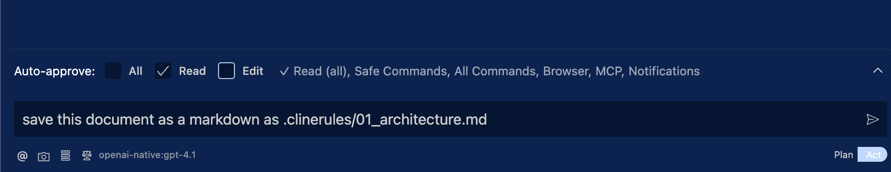

# Chapter1: Designing application

If you haven't completed [Prepartion](../../01_Preparation.md), please completes the preparation to install all tools we need in this chapter.

## Relevant PRs

You can find all commits for this chapter in the following PRs.

- https://github.com/takanabe/ai-lab/pull/2 

## Overview

Large Language Models (LLMs) are powerful, but they cannot consistently produce high-quality or accurate results without detailed and structured context. Without clear instructions, architecture, or coding standards, their output can be vague, inconsistent, or misaligned with your goals.

To address this, we introduce [Cline](https://github.com/cline/cline), an AI agent framework integrated into **VSCode**. Cline allows you to work with LLMs in a development environment using two modes:
- **Plan**: Ask the agent to think and draft content
- **Act**: Direct the agent to perform concrete actions like saving files or updating documentation

As part of this workflow, you’ll define and share project-specific context using the `.clinerules` directory. This directory holds markdown files that document your architecture, coding policies, and development tasks. These files act as persistent memory that the AI agent can refer to throughout the project.

By the end of this chapter, you'll have:
- A clearly defined architecture
- Coding policies
- A granular, testable task list for MVP development

All of this is made possible by collaborating with an AI agent that understands your context through `.clinerules`.

## What you'll do

- You will experience how to use "Plan" and "Act" in Cline.
- You will create a project structure, coding policy, and tasks as markdown files.
- You will share the markdown files as our application contexts with AI Agent.


## 1-1: Initializing project

Please create a new directory and initialize git before you start working AI-driven development.

Following commands are examples to prepare the project directory.

```bash
cd [SOMEWHERE_YOU_CAN_CREATE_YOUR_DIRECTORY]
mkdir recipe-app && cd recipe-app
git init
echo "Recipe App" > README.md
git add . && git commit -m "initial commit"
```

Let's open VSCode with the command below at the repository root

```
code .
```

If you haven't configured `code` command yet, please check [Preparation](../../01_Preparation.md) document and setup the command to use from your terminal.

## 1-2: Introducing Cline


Explaining the full details of Cline takes time. This workshop avoids deep-diving into Cline's documentation and instead focuses on giving you the essential knowledge needed to guide an AI agent effectively using Cline. If you'd like to learn more about Cline in detail after the workshop, visit https://docs.cline.bot.

Anyways, Let's configure Cline! First of all, please open the Cline window using VSCode Command Palette. You can access the VSCode Command Palette in a number of ways. Shift + Command + P (Mac) / Ctrl + Shift + P (Windows/Linux).


Next, open setting of Cline.


The only configuration we need is choosing API provider, model, and passing API key. This time, we will use OpenAI as API Provider and it's model `gpt-4.1` for the LLM. Also don't forget to put API key you have.


That's it! From now, your VSCode can work with AI Agent.

## 1-3: Designing project structure

From this point, we will start developing our application using AI. As explain at the overview, Clien has two mode "Plan",and "Act". Let's start experience "Plan" mode here. Click the new task button (the plus mark icon) to open a new Cline session.


Next, run the following prompt with "Plan" mode.

```
I'm building a cooking receipe sharing application that people register their own recipes and share with other users. Use Next.js and Material UI (UI) for frontend, Supabase for DB + auth.

Give me the full architecture:
- File + folder structure
- What each part does
- Where state lives, how services connect

Format this entire document in markdown.
```

With this prompt you will see the outputs similar to the following images.


This is what "Plan" mode does. Cline only considers what the answer for you question look like without updating existing files. If you expand API requests section, you can find the actual prompts that Cline used.


Now, we want to save this output. Please make sure that only "Read" is checked but "Edit" is unchecked then run the prompt below with "Act" mode.

```
save this document as a markdown as .clinerules/01_architecture.md
```

As the images below illustrate what the chat interface looks like for Act mode and the result looks like.




As you might notice, Cline asks you to save the file or not. Because it doesn't have "Edit" permission. We will automate this step later but for now, please click the save button and check `.clinerules/01_architecture.md`.

## 1-4: Creating coding policy

Run the following prompt with "Plan" mode.

```
Add .clinerules/02_coding_policy.md for code practice in this project. I'd like to follow TDD approach and have unit tests and E2Es.
```

Cline will create a coding policy for you similar to the following image.


The output might be not completely same but that is what LLM behaves. Change the mode from Plan to Act and save the file.


## 1-5: Creating a task list

Next, we will create a implementation task list. The quality of this task list will determine the quality of our application. The more detailed, the more expected quality application will be implemented.

To understand that we can use created clinerules under .clinerules, let's create a new Cline task first.

Click the plus mark again and create a task and we will run the following prompt with "Plan" mode.

```
Using that @/.clinerules/01_architecture.md and @/.clinerules/02_coding_policy.md , write a granular step-by-step plan to build the MVP. 

Each task should: 
- Be incredibly small + testable
- Have a clear start + end
- Focus on one concern 

I'll be passing this off to an engineering LLM that will be told to complete one task at a time, allowing me to test in between. 
```

Then, ask Clien to save the task list as `task.md`.

```
Save the task list as task.md at the repository root.
```

Change the mode from Plan to Act and save the file.

<details>
<summary>example task.md</summary>

```md
# MVP Step-by-Step Task List for Recipe Sharing App

Each task is atomic, testable, and focused on a single concern, enabling incremental progress and testing between steps.

---

## 0. Project Initialization & Tooling

1. Initialize a Next.js project with TypeScript.
2. Install and configure ESLint and Prettier with Next.js/Airbnb config.
3. Install Material UI, Supabase JS client, Jest, and React Testing Library.
4. Set up the folder structure as per architecture (`src/components`, `src/features`, etc.).
5. Add a placeholder `.env.local` and document required Supabase env vars.
6. Set up Jest config for TypeScript and React Testing Library.

---

## 1. Supabase Client & Types

7. Create `src/lib/supabaseClient.ts` to initialize Supabase client using env vars.
8. Write a unit test for Supabase client initialization (mock env vars).
9. Define global types for User and Recipe in `src/types/`.
10. Write a unit test to validate Recipe type (e.g., type guards or sample object).

---

## 2. Authentication (Login/Signup/Session)

11. Create `src/features/auth/types.ts` for auth-related types.
12. Create `src/features/auth/services.ts` with Supabase auth functions (signUp, signIn, signOut, getSession).
13. Write unit tests for each auth service function (mock Supabase).
14. Create `src/features/auth/hooks/useAuth.ts` for auth state management (session, user).
15. Write a unit test for `useAuth` hook (mock Supabase).
16. Create `src/features/auth/components/LoginForm.tsx` (email/password login form, uses Material UI).
17. Write a unit test for LoginForm (renders, submits, error states).
18. Create `src/pages/login.tsx` to render LoginForm.
19. Write an E2E test for login flow (valid/invalid login).

---

## 3. Recipe CRUD (Minimal: List, Create, View)

20. Create `src/features/recipes/types.ts` for Recipe type.
21. Create `src/features/recipes/services.ts` with Supabase CRUD functions (getRecipes, getRecipeById, createRecipe).
22. Write unit tests for each recipe service function (mock Supabase).
23. Create `src/features/recipes/hooks/useRecipes.ts` to fetch all recipes.
24. Write a unit test for useRecipes (mock service).
25. Create `src/features/recipes/hooks/useRecipeForm.ts` for new recipe form state/validation.
26. Write a unit test for useRecipeForm (validation, state).
27. Create `src/features/recipes/components/RecipeList.tsx` to display recipes (uses Material UI).
28. Write a unit test for RecipeList (renders recipes, empty state).
29. Create `src/features/recipes/components/RecipeForm.tsx` for new recipe creation (uses useRecipeForm, Material UI).
30. Write a unit test for RecipeForm (renders, submits, validation).
31. Create `src/features/recipes/components/RecipeDetail.tsx` to display a single recipe.
32. Write a unit test for RecipeDetail (renders recipe, handles missing/invalid).

---

## 4. Pages & Routing

33. Create `src/pages/_app.tsx` to set up providers (theme, auth context).
34. Create `src/pages/index.tsx` to display RecipeList (home/feed).
35. Write an E2E test for recipe feed (displays recipes, empty state).
36. Create `src/pages/recipes/new.tsx` to render RecipeForm (protected route).
37. Write an E2E test for recipe creation (form, validation, success).
38. Create `src/pages/recipes/[id].tsx` to display RecipeDetail.
39. Write an E2E test for recipe detail view (valid/invalid id).

---

## 5. Layout & Navigation

40. Create `src/layouts/MainLayout.tsx` for consistent page structure (header, footer, nav).
41. Integrate MainLayout into _app.tsx and all pages.
42. Write a unit test for MainLayout (renders children, nav links).

---

## 6. Theming & UI Consistency

43. Create `src/theme/theme.ts` for Material UI theme customization.
44. Apply theme via ThemeProvider in _app.tsx.
45. Write a unit test for theme (renders with custom theme).

---

## 7. CI, Linting, and Final Checks

46. Set up GitHub Actions (or similar) for CI: lint, test, build.
47. Write a minimal README with setup, test, and run instructions.

---

Each task is atomic, testable, and focused on one concern, enabling incremental, high-quality development and testing in line with the provided architecture and coding policy.
```
</details>

Please update the task list as you like so you can change the implementation plan for your app.

## Conclusion

In this chapter, we created architecture, coding policy, task list of an AI-driven application, which is necessary to work collaboratively with an AI agent. You learned how to structure context through markdown files, guide the model using Plan and Act modes, and align AI output with your specific development goals.

While this chapter introduced **Cline** as the agent interface inside VSCode, the key takeaway is not the tool itself, but the **approach**: providing structured context, iterating with reasoning, and treating the AI as a collaborator that understands your project’s goals.

Whether you use Cline, GitHub Copilot, Devin, or future tools yet to be built, the methods you've practiced-architecting context, defining rules, and planning step-by-step—will apply across all AI-assisted development environments.

The mindset you've developed here is what enables truly productive collaboration with AI.
