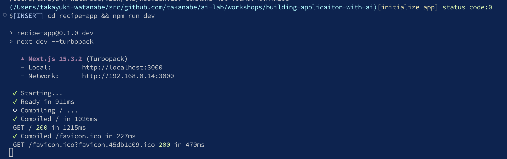
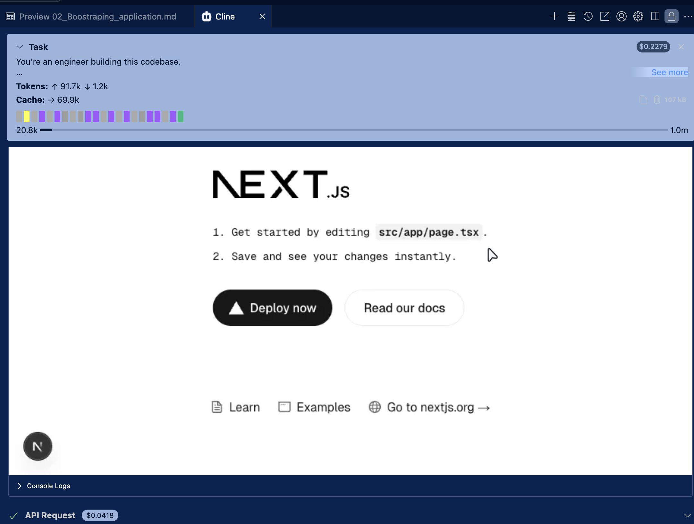
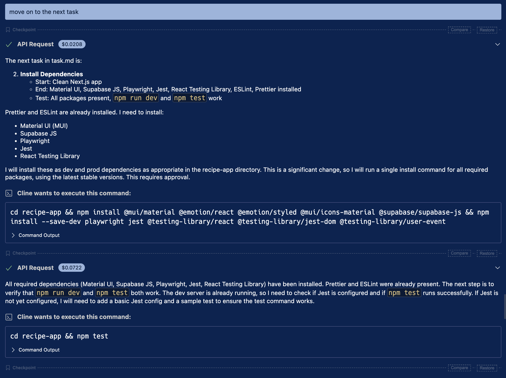
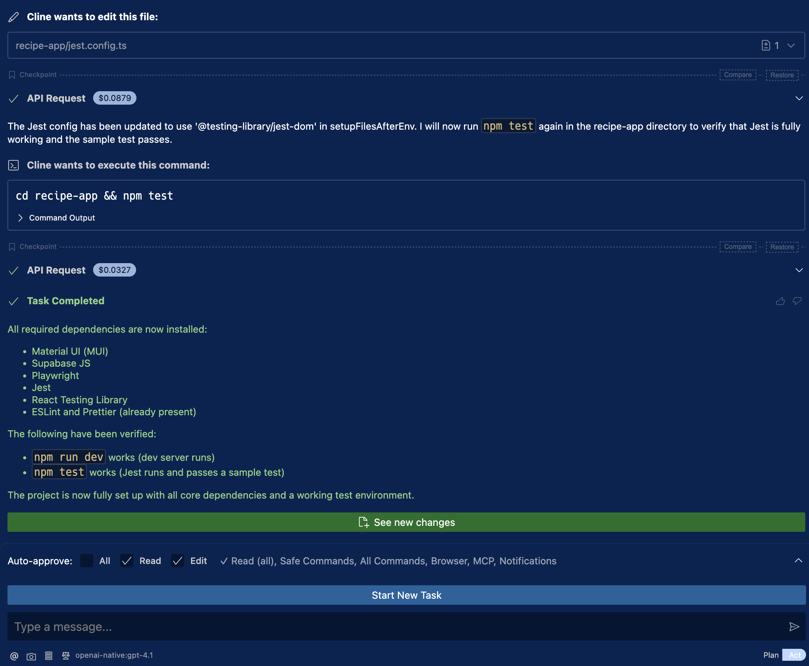
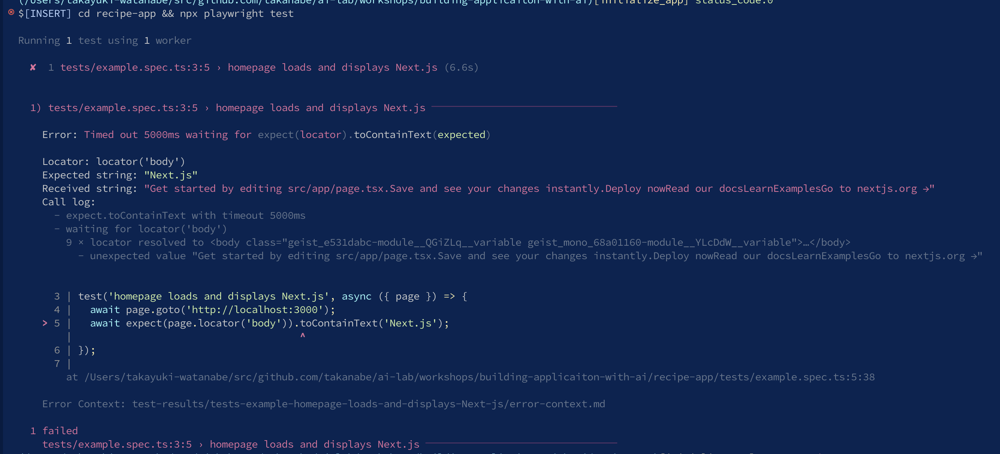
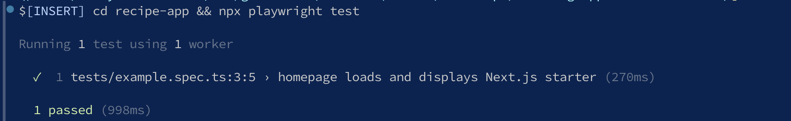

# Chapter2: Bootstrapping Application

## Relevant PRs

You can find all commits for this chapter in the following PRs.

- https://github.com/takanabe/ai-lab/pull/3

## Overview

Starting from Chapter 2, the output and behavior of prompts will vary depending on which LLM you use, how the LLM interprets your instructions, and how you intervene when the output is unintentional or low in quality. Your role will shift from simply providing prompts to actively guiding the LLM toward the desired result through refinement and interaction.

In this chapter, we will bootstrap a new Next.js application and set up a working development environment that aligns with the architecture and coding standards defined in the previous chapter.

## What you'll do

- Bootstrap a new Next.js application
- Set up development environment

## 2-1 Bootstrap a new application

To begin, run the following prompt in your LLM environment. This prompt instructs the AI agent to read the shared project context from `.clinerules/01_architecture.md` and `tasks.md`, follow the defined tasks, and proceed step-by-step.


prompt

```
You're an engineer building this codebase.

You've been given .clinerules/01_architecture.md and task.md

- Read both carefully. There should be no ambiguity about what we're building.
- Follow tasks.md and complete one task at a time.
- After each task, stop. I'll test it. If it works, commit to git and move to the next.


### CODING PROTOCOL ###
Read .clinerules/02_coding_policy.md as Coding Instructions
```

When run through Cline, this prompt initiates the project bootstrapping automatically. The agent executes commands to scaffold the Next.js application and start the development server.



Once the server is running, VSCode displays the application in its internal browser. You can confirm the application is working visually from within the editor. If you are not using internal browser, you can access the application with the URL provided in the terminal. (It's probably http://localhost:3000).




## 2-2 Update tasks.md

After bootstrapping is complete, run the following prompt to update `tasks.md` with the task you just completed:

prompt

```
Please update tasks.md to clarify which tasks we completed.
```

This ensures the task tracking remains accurate and up to date.


## 2-3 Add technology_stack document

To document the technologies used in your application, run this prompt to create a new `.clinerules` file:

prompt

```
Add a new cline rule called "03_technology_stack" and clarify we want to use


# Programming language
- TypeScript

# Web application framework
- Next.js
- React

# CSS framework
- Material UI

# Frontend state management
- Zustand
```

This step helps the AI agent understand the technical foundations of your codebase moving forward.

## 2-4 Configure formatter

Formatting is an essential part of enforcing coding consistency. Run the following prompt to configure Prettier and ensure you can format your code using a script:


prompt

```
Configure prittier and use prittier format with `npm run format`
```

After this, you can maintain formatting standards across your project using the specified command.

## 2-5 Install dependencies

Because we're following the task list from `tasks.md`, the prompt to move forward can remain simple and context-aware:

prompt

```
move on to the next task
```






However, during this step, the Playwright test triggered by Cline reports errors:

There are errors from Playwright test executed by Cline



In this situation, your role is to guide Cline to identify and resolve the test failures. Use the following prompt:

prompt

```
We must pass tests for Playwright because we have errors.
```

Once fixed, you should see the test passing output:



## 2-6 Updating coding policy

Now that you've encountered and resolved a testing issue, update the `.clinerules/02_coding_policy.md` file to reflect your policy on handling test failures.


prompt

```
Update coding_policy clien rule to add the following policy

- we always check `npx playwright test` passes without error. If there are errors. 
- We have to take a look at code changes and fix and rerun tests. 
- This loop must be executed at least 3 times if we have test failures.
```

Then update the task list to reflect completion:

prompt

```
Update tasks.md to complete the task.
```


## 2-7 Setup TypeScript

Continue the workflow by prompting the AI agent to move on:

prompt

```
Move on to the next task.
```

In most cases, TypeScript is set up automatically as part of installing dependencies. Once confirmed, update the task list:

prompt 

```
Update tasks.md to complete the task.
```

## Conclusion

In this chapter, you bootstrapped a real-world Next.js project and laid down the groundwork for an AI-assisted development workflow. You interacted with the LLM in a more dynamic, iterative fashion—handling not just generation but also debugging, formatting, and test execution.

You also saw how tasks, context files, and coding policies work together to create a repeatable, high-confidence workflow with an AI agent. While the tool in this case was Cline, the core takeaway is learning how to coordinate agents, prompts, and context to drive real progress in a codebase.
