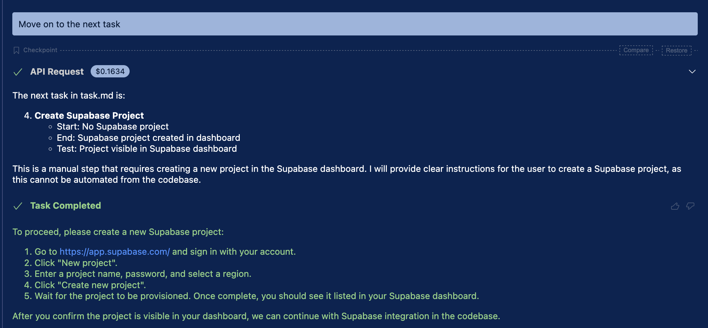
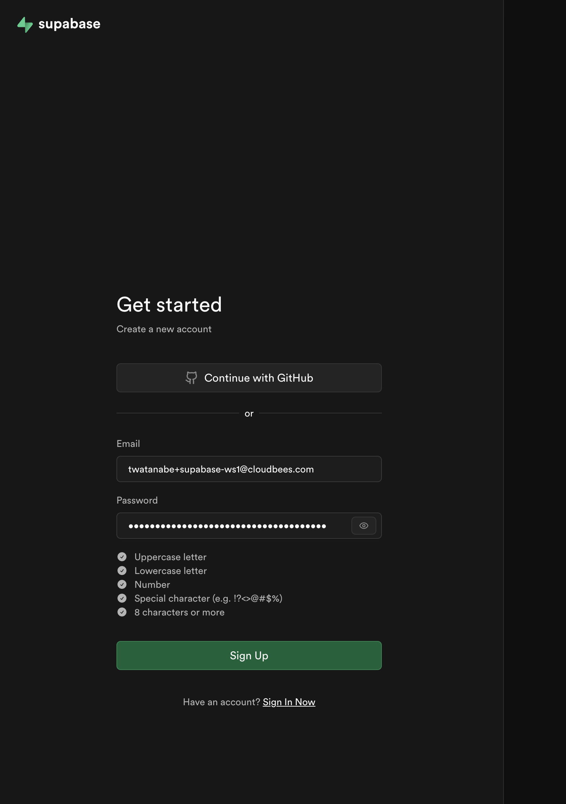
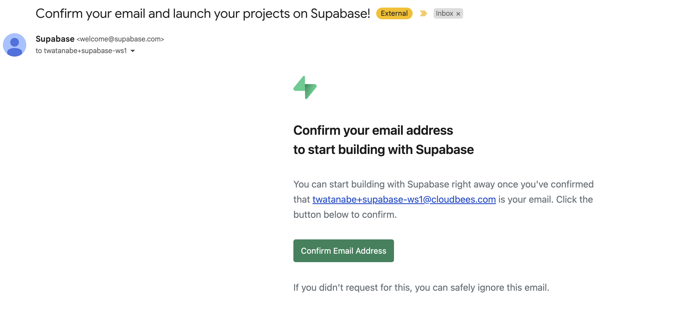
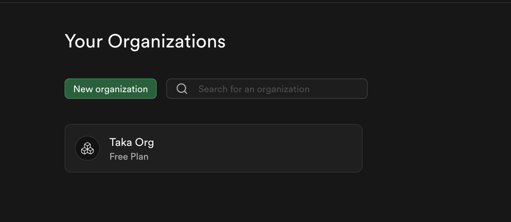
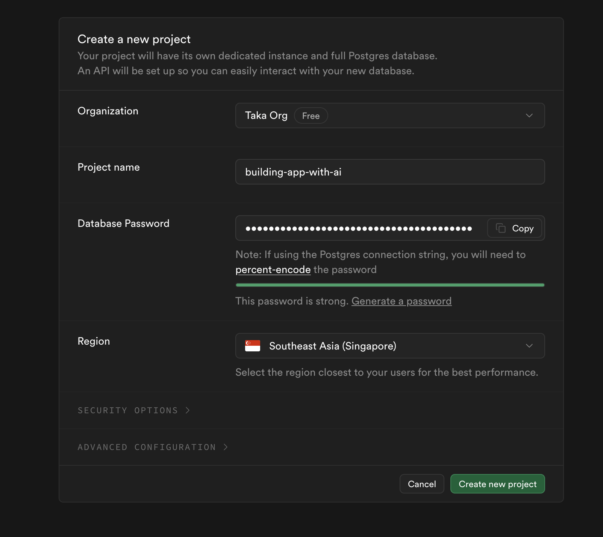
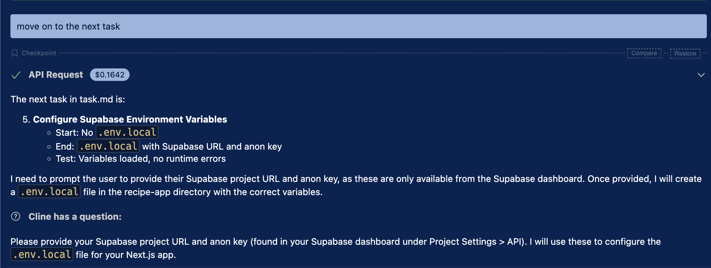
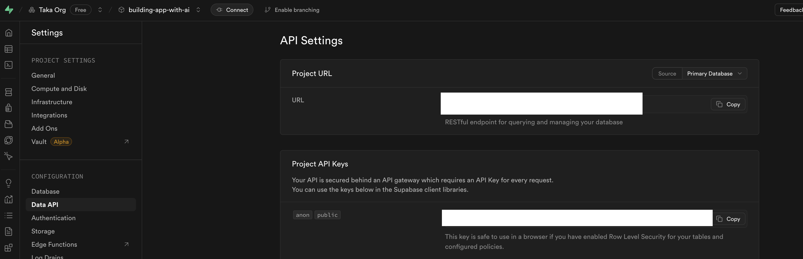
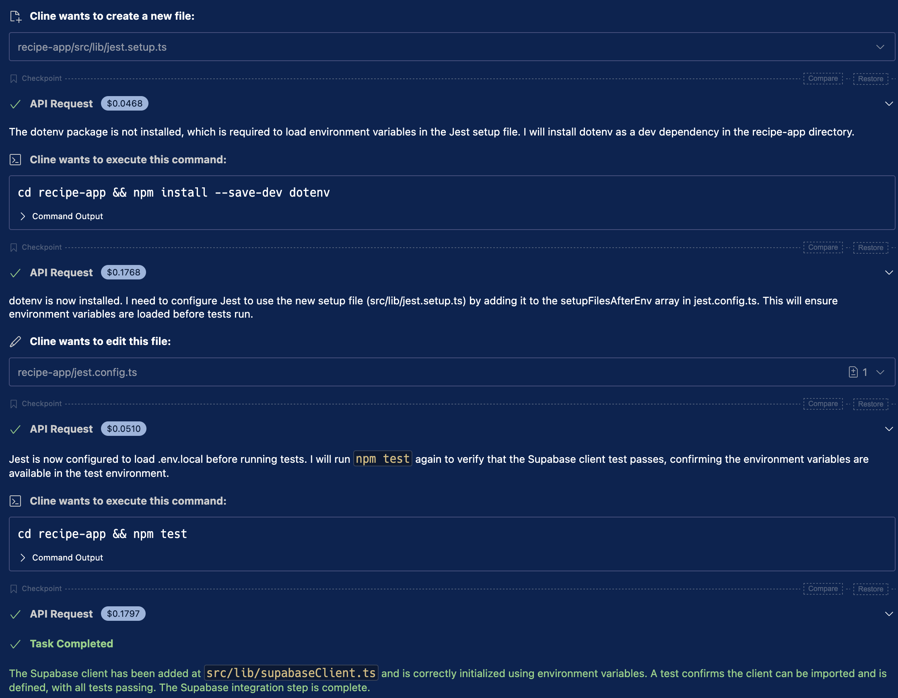
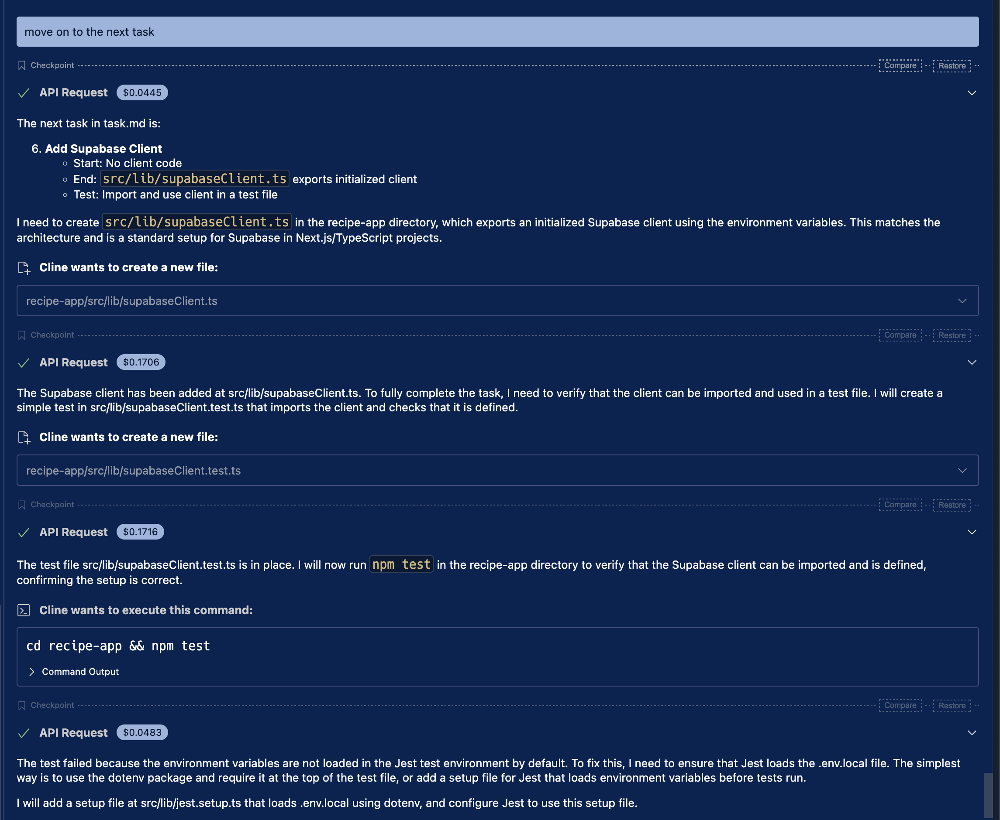

# Integrating Supabase

## Overview

We SaaS called [Supabase](https://supabase.com/) for DB and Authentication. In this document, we will configure Supabase **Manually** before we use from our app.


## Sign-up

prompt

```
Move on to the next task.
```

With this prompt, Cline will guide you to prepare Supabase manually.




Please create a new Supabase account from https://supabase.com/dashboard/sign-up

### Register your email and passowrd



### Verify your registration





### Configure organization and project

Configure a new organization with "Free Plan".





```
Update tasks.md to complete the task.
```

## Configuring env vars







prompt

```
Use following project URL and ANON key

Project URL: https://XXXXXXX.supabase.co
ANON key: YYYYYYYY
```

```
Update tasks.md to complete the task.
```

## Configure Supabase client

prompt

```
move on to the next task
```

This conifigured Supabase client and dotenv.





prompt

```
Update tasks.md to complete the task.
```
