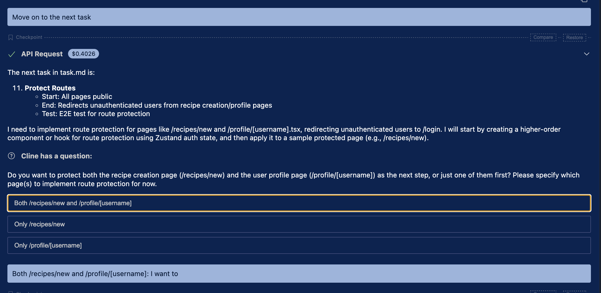

# 4 Authentication

## Relevant PRs

You can find all commits for this chapter in the following PRs.

- https://github.com/takanabe/ai-lab/pull/5

## Overview

In this chapter, you'll implement user authentication by building sign-up and login forms and integrating them with Supabase. This chapter also includes how to persist the authentication state and protect routes that require login. You'll encounter real-world challenges such as failing tests and design mismatches, which give you opportunities to practice guiding an AI agent through iterative debugging, testing, and UI refinement.

One of the key takeaways here is that working with AI agents like Cline isn't just about generating code—it's about **collaborating**. The agent uses your context, runs loops to resolve failures, and follows coding conventions defined in `.clinerules`, just like a human teammate would.


## 4-1 Implement Sign Up Form

To start the authentication feature, run the following prompt:

```
Move on to the next task.
```

In Taka' case, while he was adding a new code, there were test failures. Thanks to , even if there are failures to the new code, Cline try to find the root cause and fix the code automatically.

This triggers Cline to begin implementing the sign-up form. During this step, Cline writes the form and test code. However, some test failures are encountered due to misconfigurations or JSX transform issues. Fortunately, because we defined a clear policy in [.clinerules/02_coding_policy.md](../../.clinerules/02_coding_policy.md), the AI agent automatically attempts to debug and fix issues in a loop until tests pass.


<details>
<summary>Loop without human interactions to fix code and test</summary>

```bash
$ cd recipe-app && npm test

> recipe-app@0.1.0 test
> jest

ts-jest[ts-jest-transformer] (WARN) Define `ts-jest` config under `globals` is deprecated. Please do
transform: {
    <transform_regex>: ['ts-jest', { /* ts-jest config goes here in Jest */ }],
},
See more at https://kulshekhar.github.io/ts-jest/docs/getting-started/presets#advanced
 FAIL  src/features/auth/components/SignUpForm.test.tsx
  ● Test suite failed to run

    Jest encountered an unexpected token

    Jest failed to parse a file. This happens e.g. when your code or its dependencies use non-standard JavaScript syntax, or when Jest is not configured to support such syntax.

    Out of the box Jest supports Babel, which will be used to transform your files into valid JS based on your Babel configuration.

    By default "node_modules" folder is ignored by transformers.

    Here's what you can do:
     • If you are trying to use ECMAScript Modules, see https://jestjs.io/docs/ecmascript-modules for how to enable it.
     • If you are trying to use TypeScript, see https://jestjs.io/docs/getting-started#using-typescript
     • To have some of your "node_modules" files transformed, you can specify a custom "transformIgnorePatterns" in your config.
     • If you need a custom transformation specify a "transform" option in your config.
     • If you simply want to mock your non-JS modules (e.g. binary assets) you can stub them out with the "moduleNameMapper" config option.

    You'll find more details and examples of these config options in the docs:
    https://jestjs.io/docs/configuration
    For information about custom transformations, see:
    https://jestjs.io/docs/code-transformation

    Details:

    /Users/takayuki-watanabe/src/github.com/takanabe/ai-lab/workshops/building-applicaiton-with-ai/recipe-app/src/features/auth/components/SignUpForm.test.tsx:23
            (0, react_2.render)(<SignUpForm_1.SignUpForm />);
                                ^

    SyntaxError: Unexpected token '<'

      at Runtime.createScriptFromCode (node_modules/jest-runtime/build/index.js:1505:14)

 PASS  src/lib/supabaseClient.test.ts

Test Suites: 1 failed, 1 passed, 2 total
Tests:       1 passed, 1 total
Snapshots:   0 total
Time:        0.807 s, estimated 1 s
Ran all test suites.
(/Users/takayuki-watanabe/src/github.com/takanabe/ai-lab/workshops/building-applicaiton-with-ai/recipe-app)[main] status_code:1   
$[INSERT] cd "/Users/takayuki-watanabe/src/github.com/takanabe/ai-lab/workshops/building-applicaiton-with-ai"
(/Users/takayuki-watanabe/src/github.com/takanabe/ai-lab/workshops/building-applicaiton-with-ai)[main] status_code:0              
$[INSERT] cd recipe-app && npm test

> recipe-app@0.1.0 test
> jest

 PASS  src/lib/supabaseClient.test.ts
 FAIL  src/features/auth/components/SignUpForm.test.tsx
  ● Test suite failed to run

    Jest encountered an unexpected token

    Jest failed to parse a file. This happens e.g. when your code or its dependencies use non-standard JavaScript syntax, or when Jest is not configured to support such syntax.

    Out of the box Jest supports Babel, which will be used to transform your files into valid JS based on your Babel configuration.

    By default "node_modules" folder is ignored by transformers.

    Here's what you can do:
     • If you are trying to use ECMAScript Modules, see https://jestjs.io/docs/ecmascript-modules for how to enable it.
     • If you are trying to use TypeScript, see https://jestjs.io/docs/getting-started#using-typescript
     • To have some of your "node_modules" files transformed, you can specify a custom "transformIgnorePatterns" in your config.
     • If you need a custom transformation specify a "transform" option in your config.
     • If you simply want to mock your non-JS modules (e.g. binary assets) you can stub them out with the "moduleNameMapper" config option.

    You'll find more details and examples of these config options in the docs:
    https://jestjs.io/docs/configuration
    For information about custom transformations, see:
    https://jestjs.io/docs/code-transformation

    Details:

    /Users/takayuki-watanabe/src/github.com/takanabe/ai-lab/workshops/building-applicaiton-with-ai/recipe-app/src/features/auth/components/SignUpForm.test.tsx:23
            (0, react_2.render)(<SignUpForm_1.SignUpForm />);
                                ^

    SyntaxError: Unexpected token '<'

      at Runtime.createScriptFromCode (node_modules/jest-runtime/build/index.js:1505:14)

Test Suites: 1 failed, 1 passed, 2 total
Tests:       1 passed, 1 total
Snapshots:   0 total
Time:        0.853 s, estimated 1 s
Ran all test suites.
(/Users/takayuki-watanabe/src/github.com/takanabe/ai-lab/workshops/building-applicaiton-with-ai/recipe-app)[main] status_code:1   
$[INSERT] cd "/Users/takayuki-watanabe/src/github.com/takanabe/ai-lab/workshops/building-applicaiton-with-ai"
(/Users/takayuki-watanabe/src/github.com/takanabe/ai-lab/workshops/building-applicaiton-with-ai)[main] status_code:0              
$[INSERT] cd recipe-app && npm test

> recipe-app@0.1.0 test
> jest

 PASS  src/lib/supabaseClient.test.ts
 FAIL  src/features/auth/components/SignUpForm.test.tsx
  ● Console

    console.warn
      Your app (or one of its dependencies) is using an outdated JSX transform. Update to the modern JSX transform for faster performance: https://react.dev/link/new-jsx-transform

      20 |
      21 |   it('renders form fields', () => {
    > 22 |     render(<SignUpForm />);
         |            ^
      23 |     expect(screen.getByLabelText(/email/i)).toBeInTheDocument();
      24 |     expect(screen.getByLabelText(/password/i)).toBeInTheDocument();
      25 |     expect(screen.getByRole('button', { name: /sign up/i })).toBeInTheDocument();

      at __jsx (node_modules/react/cjs/react.development.js:991:19)
      at Object.<anonymous> (src/features/auth/components/SignUpForm.test.tsx:22:12)

  ● SignUpForm › shows validation error if fields are empty

    Unable to find an element with the text: /email and password are required/i. This could be because the text is broken up by multiple elements. In this case, you can provide a function for your text matcher to make your matcher more flexible.

    Ignored nodes: comments, script, style
    <body>
      <div>
        <form>
          <h2>
            Sign Up
          </h2>
          <div>
            <label>
              Email:
              <input
                autocomplete="email"
                required=""
                type="email"
                value=""
              />
            </label>
          </div>
          <div>
            <label>
              Password:
              <input
                autocomplete="new-password"
                minlength="6"
                required=""
                type="password"
                value=""
              />
            </label>
          </div>
          <button
            type="submit"
          >
            Sign Up
          </button>
        </form>
      </div>
    </body>

      29 |     render(<SignUpForm />);
      30 |     fireEvent.click(screen.getByRole('button', { name: /sign up/i }));
    > 31 |     expect(await screen.findByText(/email and password are required/i)).toBeInTheDocument();
         |                         ^
      32 |     expect(mockSignUp).not.toHaveBeenCalled();
      33 |   });
      34 |

      at waitForWrapper (node_modules/@testing-library/dom/dist/wait-for.js:163:27)
      at findByText (node_modules/@testing-library/dom/dist/query-helpers.js:86:33)
      at Object.<anonymous> (src/features/auth/components/SignUpForm.test.tsx:31:25)

Test Suites: 1 failed, 1 passed, 2 total
Tests:       1 failed, 5 passed, 6 total
Snapshots:   0 total
Time:        2.392 s
Ran all test suites.
(/Users/takayuki-watanabe/src/github.com/takanabe/ai-lab/workshops/building-applicaiton-with-ai/recipe-app)[main] status_code:1   
$[INSERT] cd "/Users/takayuki-watanabe/src/github.com/takanabe/ai-lab/workshops/building-applicaiton-with-ai"
(/Users/takayuki-watanabe/src/github.com/takanabe/ai-lab/workshops/building-applicaiton-with-ai)[main] status_code:0              
$[INSERT] cd recipe-app && npm test

> recipe-app@0.1.0 test
> jest

 PASS  src/lib/supabaseClient.test.ts
 FAIL  src/features/auth/components/SignUpForm.test.tsx
  ● Console

    console.warn
      Your app (or one of its dependencies) is using an outdated JSX transform. Update to the modern JSX transform for faster performance: https://react.dev/link/new-jsx-transform

      20 |
      21 |   it('renders form fields', () => {
    > 22 |     render(<SignUpForm />);
         |            ^
      23 |     expect(screen.getByLabelText(/email/i)).toBeInTheDocument();
      24 |     expect(screen.getByLabelText(/password/i)).toBeInTheDocument();
      25 |     expect(screen.getByRole('button', { name: /sign up/i })).toBeInTheDocument();

      at Object.<anonymous>.process.env.NODE_ENV.exports.createElement (node_modules/react/cjs/react.development.js:991:19)
      at Object.__jsx (src/features/auth/components/SignUpForm.test.tsx:22:12)

  ● SignUpForm › shows validation error if fields are empty

    Unable to find an element with the text: content => content.includes('Email and password are required'). This could be because the text is broken up by multiple elements. In this case, you can provide a function for your text matcher to make your matcher more flexible.

    Ignored nodes: comments, script, style
    <body>
      <div>
        <form>
          <h2>
            Sign Up
          </h2>
          <div>
            <label>
              Email:
              <input
                autocomplete="email"
                required=""
                type="email"
                value=""
              />
            </label>
          </div>
          <div>
            <label>
              Password:
              <input
                autocomplete="new-password"
                minlength="6"
                required=""
                type="password"
                value=""
              />
            </label>
          </div>
          <button
            type="submit"
          >
            Sign Up
          </button>
        </form>
      </div>
    </body>

      30 |     fireEvent.click(screen.getByRole('button', { name: /sign up/i }));
      31 |     expect(
    > 32 |       await screen.findByText((content) => content.includes('Email and password are required'))
         |                    ^
      33 |     ).toBeInTheDocument();
      34 |     expect(mockSignUp).not.toHaveBeenCalled();
      35 |   });

      at waitForWrapper (node_modules/@testing-library/dom/dist/wait-for.js:163:27)
      at node_modules/@testing-library/dom/dist/query-helpers.js:86:33
      at Object.findByText (src/features/auth/components/SignUpForm.test.tsx:32:20)

Test Suites: 1 failed, 1 passed, 2 total
Tests:       1 failed, 5 passed, 6 total
Snapshots:   0 total
Time:        2.774 s
Ran all test suites.
(/Users/takayuki-watanabe/src/github.com/takanabe/ai-lab/workshops/building-applicaiton-with-ai/recipe-app)[main] status_code:1   
$[INSERT] cd "/Users/takayuki-watanabe/src/github.com/takanabe/ai-lab/workshops/building-applicaiton-with-ai"
(/Users/takayuki-watanabe/src/github.com/takanabe/ai-lab/workshops/building-applicaiton-with-ai)[main] status_code:0              
$[INSERT] cd recipe-app && npm test

> recipe-app@0.1.0 test
> jest

 PASS  src/lib/supabaseClient.test.ts
 FAIL  src/features/auth/components/SignUpForm.test.tsx
  ● Console

    console.warn
      Your app (or one of its dependencies) is using an outdated JSX transform. Update to the modern JSX transform for faster performance: https://react.dev/link/new-jsx-transform

      20 |
      21 |   it('renders form fields', () => {
    > 22 |     render(<SignUpForm />);
         |            ^
      23 |     expect(screen.getByLabelText(/email/i)).toBeInTheDocument();
      24 |     expect(screen.getByLabelText(/password/i)).toBeInTheDocument();
      25 |     expect(screen.getByRole('button', { name: /sign up/i })).toBeInTheDocument();

      at Object.<anonymous>.process.env.NODE_ENV.exports.createElement (node_modules/react/cjs/react.development.js:991:19)
      at Object.__jsx (src/features/auth/components/SignUpForm.test.tsx:22:12)

  ● SignUpForm › shows validation error if fields are empty

    TestingLibraryElementError: Unable to find an element with the text: content => content.includes('Email and password are required'). This could be because the text is broken up by multiple elements. In this case, you can provide a function for your text matcher to make your matcher more flexible.

    Ignored nodes: comments, script, style
    <body>
      <div>
        <form>
          <h2>
            Sign Up
          </h2>
          <div>
            <label>
              Email:
              <input
                autocomplete="email"
                required=""
                type="email"
                value=""
              />
            </label>
          </div>
          <div>
            <label>
              Password:
              <input
                autocomplete="new-password"
                minlength="6"
                required=""
                type="password"
                value=""
              />
            </label>
          </div>
          <button
            type="submit"
          >
            Sign Up
          </button>
        </form>
      </div>
    </body>

      30 |     fireEvent.click(screen.getByRole('button', { name: /sign up/i }));
      31 |     expect(
    > 32 |       screen.getByText((content) => content.includes('Email and password are required'))
         |              ^
      33 |     ).toBeInTheDocument();
      34 |     expect(mockSignUp).not.toHaveBeenCalled();
      35 |   });

      at Object.getElementError (node_modules/@testing-library/dom/dist/config.js:37:19)
      at node_modules/@testing-library/dom/dist/query-helpers.js:76:38
      at node_modules/@testing-library/dom/dist/query-helpers.js:52:17
      at node_modules/@testing-library/dom/dist/query-helpers.js:95:19
      at Object.getByText (src/features/auth/components/SignUpForm.test.tsx:32:14)

Test Suites: 1 failed, 1 passed, 2 total
Tests:       1 failed, 5 passed, 6 total
Snapshots:   0 total
Time:        1.48 s, estimated 3 s
Ran all test suites.
(/Users/takayuki-watanabe/src/github.com/takanabe/ai-lab/workshops/building-applicaiton-with-ai/recipe-app)[main] status_code:1                                                                         
$[INSERT] cd "/Users/takayuki-watanabe/src/github.com/takanabe/ai-lab/workshops/building-applicaiton-with-ai"
(/Users/takayuki-watanabe/src/github.com/takanabe/ai-lab/workshops/building-applicaiton-with-ai)[main] status_code:0                                                                                    
$[INSERT] cd recipe-app && npm test

> recipe-app@0.1.0 test
> jest

 FAIL  src/features/auth/components/SignUpForm.test.tsx
  ● Console

    console.warn
      Your app (or one of its dependencies) is using an outdated JSX transform. Update to the modern JSX transform for faster performance: https://react.dev/link/new-jsx-transform

      20 |
      21 |   it('renders form fields', () => {
    > 22 |     render(<SignUpForm />);
         |            ^
      23 |     expect(screen.getByLabelText(/email/i)).toBeInTheDocument();
      24 |     expect(screen.getByLabelText(/password/i)).toBeInTheDocument();
      25 |     expect(screen.getByRole('button', { name: /sign up/i })).toBeInTheDocument();

      at __jsx (node_modules/react/cjs/react.development.js:991:19)
      at Object.<anonymous> (src/features/auth/components/SignUpForm.test.tsx:22:12)

    console.log
      <body>
        <div>
          <form>
            <h2>
              Sign Up
            </h2>
            <div>
              <label>
                Email:
                <input
                  autocomplete="email"
                  required=""
                  type="email"
                  value=""
                />
              </label>
            </div>
            <div>
              <label>
                Password:
                <input
                  autocomplete="new-password"
                  minlength="6"
                  required=""
                  type="password"
                  value=""
                />
              </label>
            </div>
            <button
              type="submit"
            >
              Sign Up
            </button>
          </form>
        </div>
      </body>
      
      /Users/takayuki-watanabe/src/github.com/takanabe/ai-lab/workshops/building-applicaiton-with-ai/recipe-app/src/features/auth/components/SignUpForm.test.tsx:35:12
        33 |     // @ts-ignore
        34 |     // eslint-disable-next-line testing-library/no-debugging-utils
      > 35 |     screen.debug();
           |            ^

      at logDOM (node_modules/@testing-library/dom/dist/pretty-dom.js:92:13)

  ● SignUpForm › shows validation error if fields are empty

    TestingLibraryElementError: Unable to find an element with the text: content => content.includes('Email and password are required'). This could be because the text is broken up by multiple elements. In this case, you can provide a function for your text matcher to make your matcher more flexible.

    Ignored nodes: comments, script, style
    <body>
      <div>
        <form>
          <h2>
            Sign Up
          </h2>
          <div>
            <label>
              Email:
              <input
                autocomplete="email"
                required=""
                type="email"
                value=""
              />
            </label>
          </div>
          <div>
            <label>
              Password:
              <input
                autocomplete="new-password"
                minlength="6"
                required=""
                type="password"
                value=""
              />
            </label>
          </div>
          <button
            type="submit"
          >
            Sign Up
          </button>
        </form>
      </div>
    </body>

      35 |     screen.debug();
      36 |     expect(
    > 37 |       screen.getByText((content) => content.includes('Email and password are required'))
         |              ^
      38 |     ).toBeInTheDocument();
      39 |     expect(mockSignUp).not.toHaveBeenCalled();
      40 |   });

      at Object.getElementError (node_modules/@testing-library/dom/dist/config.js:37:19)
      at node_modules/@testing-library/dom/dist/query-helpers.js:76:38
      at node_modules/@testing-library/dom/dist/query-helpers.js:52:17
      at getByText (node_modules/@testing-library/dom/dist/query-helpers.js:95:19)
      at Object.<anonymous> (src/features/auth/components/SignUpForm.test.tsx:37:14)

 PASS  src/lib/supabaseClient.test.ts

Test Suites: 1 failed, 1 passed, 2 total
Tests:       1 failed, 5 passed, 6 total
Snapshots:   0 total
Time:        1.188 s
Ran all test suites.
(/Users/takayuki-watanabe/src/github.com/takanabe/ai-lab/workshops/building-applicaiton-with-ai/recipe-app)[main] status_code:1                                                                         
$[INSERT] cd "/Users/takayuki-watanabe/src/github.com/takanabe/ai-lab/workshops/building-applicaiton-with-ai"
(/Users/takayuki-watanabe/src/github.com/takanabe/ai-lab/workshops/building-applicaiton-with-ai)[main] status_code:0                                                                                    
$[INSERT] cd recipe-app && npm test

> recipe-app@0.1.0 test
> jest

 PASS  src/features/auth/components/SignUpForm.test.tsx
  ● Console

    console.warn
      Your app (or one of its dependencies) is using an outdated JSX transform. Update to the modern JSX transform for faster performance: https://react.dev/link/new-jsx-transform

      20 |
      21 |   it('renders form fields', () => {
    > 22 |     render(<SignUpForm />);
         |            ^
      23 |     expect(screen.getByLabelText(/email/i)).toBeInTheDocument();
      24 |     expect(screen.getByLabelText(/password/i)).toBeInTheDocument();
      25 |     expect(screen.getByRole('button', { name: /sign up/i })).toBeInTheDocument();

      at __jsx (node_modules/react/cjs/react.development.js:991:19)
      at Object.<anonymous> (src/features/auth/components/SignUpForm.test.tsx:22:12)

    console.log
      <body>
        <div>
          <form>
            <h2>
              Sign Up
            </h2>
            <div>
              <label>
                Email:
                <input
                  autocomplete="email"
                  type="email"
                  value=""
                />
              </label>
            </div>
            <div>
              <label>
                Password:
                <input
                  autocomplete="new-password"
                  minlength="6"
                  type="password"
                  value=""
                />
              </label>
            </div>
            <button
              type="submit"
            >
              Sign Up
            </button>
            <div
              style="color: red;"
            >
              Email and password are required.
            </div>
          </form>
        </div>
      </body>
      
      /Users/takayuki-watanabe/src/github.com/takanabe/ai-lab/workshops/building-applicaiton-with-ai/recipe-app/src/features/auth/components/SignUpForm.test.tsx:35:12
        33 |     // @ts-ignore
        34 |     // eslint-disable-next-line testing-library/no-debugging-utils
      > 35 |     screen.debug();
           |            ^

      at logDOM (node_modules/@testing-library/dom/dist/pretty-dom.js:92:13)

 PASS  src/lib/supabaseClient.test.ts

Test Suites: 2 passed, 2 total
Tests:       6 passed, 6 total
Snapshots:   0 total
Time:        1.211 s
Ran all test suites.
```
</details>

After resolving the test issues, update your task list by running:

prompt

```
Update tasks.md to complete the task.
```

## 4-2 Implement Login Form

Next, instruct Cline to continue with the login form:

prompt

```
Move on to the next task.
```

Cline will add the login form component without issues. Once complete, update your task list:

prompt

```
Update tasks.md to complete the task.
```

## 4-3 Add Auth Page and Apply MUI

Continue with the following prompt:

prompt

```
Move on to the next task.
```

Once the login page is created, instruct Cline to add tests:

prompt

```
Write tests and confirm if login page works.
```

To improve UX, eliminate redundant text on the page:

prompt

```
Both page and Login Form component has "Login" and we display two Login texts. Please elimiate the redundancy. So as SignUpForm.
```

Also, ensure the UI follows your technology guidelines:

prompt

```
Follow @/.clinerules/03_technology_stack.md . You must apply Material UI while we are implementing Next.js pages and React components.
```


Once the UI and tests are confirmed, mark the task as complete:

prompt

```
Update tasks.md to complete the task.
```


## 4-4 Persist Auth State

Continue implementation with:

prompt

```
Move on to the next task.
```

Ensure session persistence is handled through Supabases auth listener. Once implemented, record completion:


prompt

```
Update tasks.md to complete the task.
```

## 4-5 Protect Routes

Move to the final step in authentication:

prompt

```
Move on to the next task.
```

During this phase, Taka faced a challenge regarding redundant authentication logic in each page. Cline asks for clarification:



Answer with this prompt to guide toward a global solution:

prompt

```
I don't want to write 

  ---ts
  const user = useRequireAuth();
  const router = useRouter();
  const { username } = router.query;

  if (!user) return null;
  ---

For all pages we need to authenticate. Are there any ideas to manage this in a single place?
```

After implementing a centralized auth solution (e.g., a wrapper component or route-level guard), finish the task by running:

prompt

```
Update tasks.md to complete the task.
```

# Conclusion

In this chapter, you completed end-to-end authentication for your application, covering sign-up, login, state persistence, and route protection. You encountered and resolved real development challenges—test failures, outdated JSX warnings, UI redundancy, and architectural questions.

By applying AI agent collaboration with structured rules, you were able to recover from failures, enforce consistency, and make incremental progress without getting stuck. This process is similar to working with a junior teammate guided by clearly defined standards.
