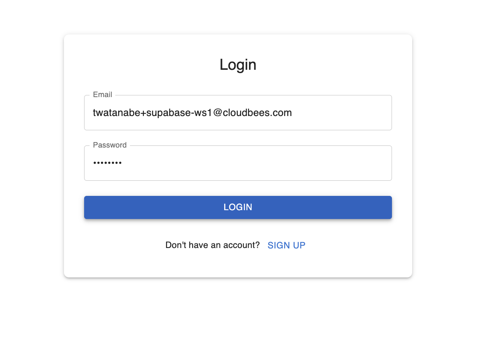

# 5 Sync users between auth.users and public.users

## Relevant PRs

You can find all commits for this chapter in the following PRs.

- https://github.com/takanabe/ai-lab/pull/6

## Overview

Supabase manages authentication data in the `auth.users` table, but this table is restricted and cannot be freely queried or joined in the same way as normal application tables. When building features like user search, dashboards, or profile editing, it's important to maintain a separate `public.users` table in the `public` schema. This table allows you to store and query user-specific data—such as first and last names—using standard SQL and application logic. 

In this chapter, you'll manually configure a trigger to automatically create a `public.users` record when a new user is added to `auth.users`, keeping both tables in sync.


## 5-1 Setup auth.users and public.users sync (and storing first/last name)

To begin, we need to create a new `public.users` table and configure Supabase to automatically insert rows into this table when a user is created in `auth.users`.

First, run the following prompt:

```
We need a `public.users` table  in Supabase. We only need 

- id
- first_name
- last_name

columns.

Also, for authentication, we usse `auth.users` table but the user ID is not synced automatically between auth.users and public.users. 

Please show SQLs for creating public.users table a trigger to create a new public.users when new users are added to auth.users.
```

Cline will display the necessary SQL commands to execute in the Supabase SQL editor:

```sql
-- 1. Create the public.users table
create table public.users (
  id uuid primary key,
  first_name text,
  last_name text
);

-- 2. Create a function to insert into public.users when a new auth.users row is created
create or replace function public.handle_new_auth_user()
returns trigger as $$
begin
  insert into public.users (id, first_name, last_name)
  values (new.id, '', '');
  return new;
end;
$$ language plpgsql security definer;

-- 3. Create a trigger on auth.users to call the function after insert
create trigger on_auth_user_created
after insert on auth.users
for each row execute procedure public.handle_new_auth_user();
```


Execute these SQLs in the Supabase SQL Editor to complete the setup.

After that, ask Cline to update the code and documentation to reflect this synchronization logic:


prompt

```
Update documents, code, and tests
```

<details>
<summary>details for sync logic</summary>

To manage user profiles, we use two tables in Supabase:

- `auth.users`: Managed by Supabase Auth, stores authentication info.
- `public.users`: Stores user profile info (id, first_name, last_name).

### Step 1: Create and Sync public.users

```sql
-- 1. Create the public.users table
create table public.users (
  id uuid primary key,
  first_name text,
  last_name text
);

-- 2. Create a function to insert into public.users when a new auth.users row is created
create or replace function public.handle_new_auth_user()
returns trigger as $$
begin
  insert into public.users (id, first_name, last_name)
  values (new.id, '', '');
  return new;
end;
$$ language plpgsql security definer;

-- 3. Create a trigger on auth.users to call the function after insert
create trigger on_auth_user_created
after insert on auth.users
for each row execute procedure public.handle_new_auth_user();
```

### Step 2: Storing First and Last Name

After a user signs up, the app collects `first_name` and `last_name` in the SignUp form. Once the user is created in `auth.users`, the app updates the corresponding row in `public.users`:

```ts
// After successful signup and user is available
await supabase
  .from('users')
  .update({ first_name, last_name })
  .eq('id', user.id);
```

The code is responsible for this logic. This ensures that user profile information is kept in sync with authentication.
</details>

The following screenshots confirm the flow from sign-up through login, showing the synced state of user data:





To finalize this step, make sure your task list is updated to reflect the new section:

prompt

```
Add "## 3. Sync DB users (auth.users and public.users)" to tasks.md and tune other section number starting from 3 with corresponded number.
```

# Conclusion

In this chapter, you configured Supabase to automatically synchronize user data between auth.users and your custom public.users table. This pattern allows your application to manage user profile data like names or preferences without interfering with the core authentication logic handled by Supabase.

You also used SQL triggers to automate this syncing process and updated your app to populate profile information after sign-up. This is a scalable and maintainable way to separate concerns between identity and user-specific attributes.

As your application grows, this separation of authentication and domain-specific user data will make your architecture more flexible and easier to extend.
