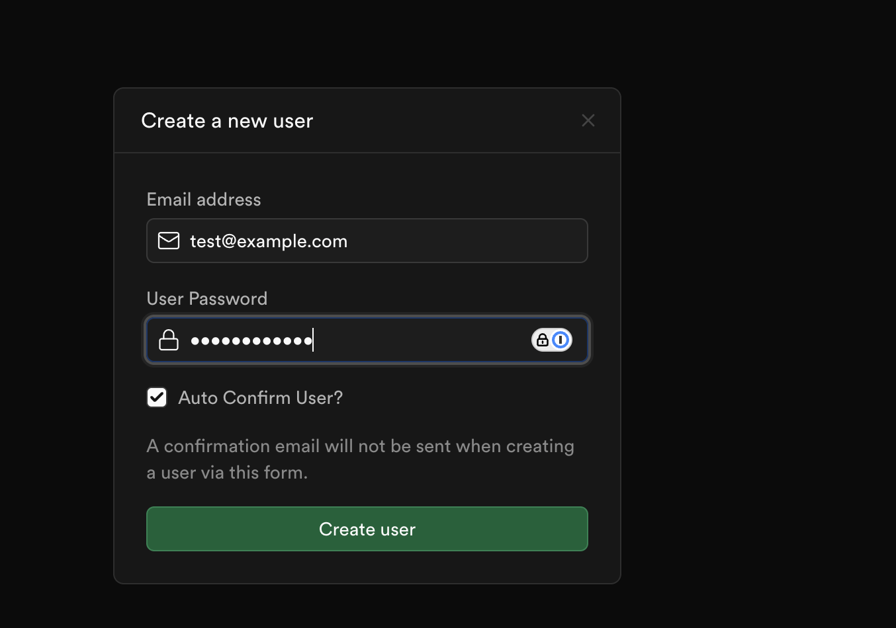
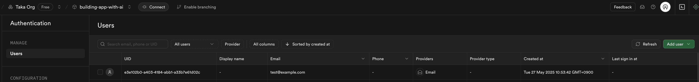
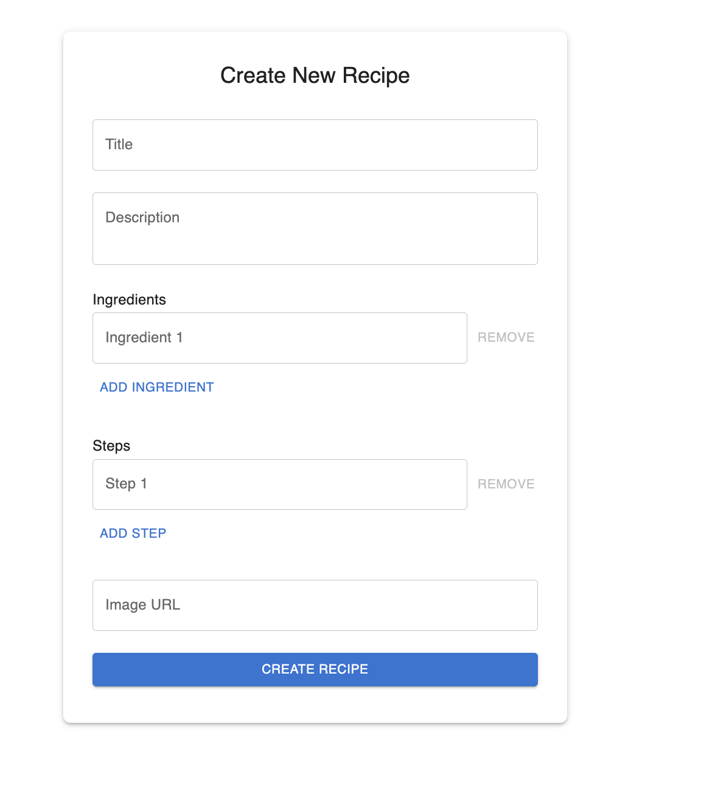
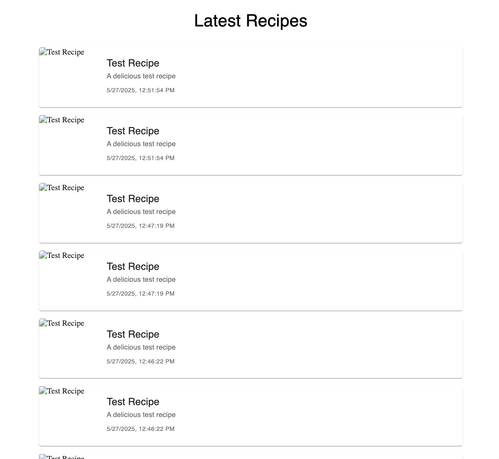
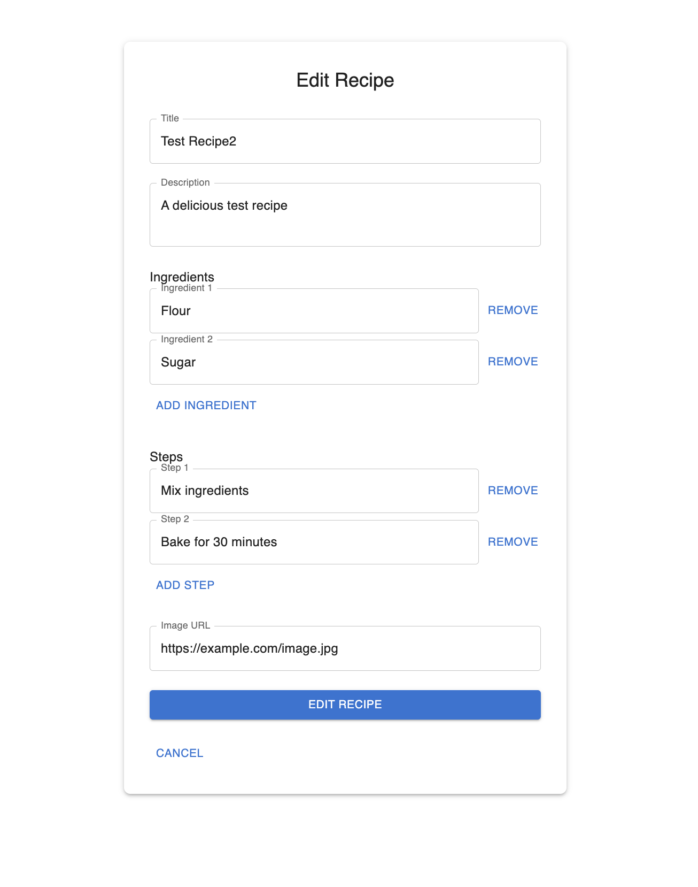

# Recipe CRUD

## Relevant PRs

You can find all commits for this chapter in the following PRs.

- https://github.com/takanabe/ai-lab/pull/7

## Instruction

Now you have learned how use Cline for writing code and test.

From now on, we don't have detailed steps. Instead, we will use "Loop without human interaction" technique that provide a prompt to complete multiple tasks listed in [](../../task.md).

If you haven't allow Cline to edit your code, give the permission from here.

prompt

```
Execute task 4: Recipe CRUD from start to end.
```

AI will ask you to run the following SQLs on Supabase SQL Editor to create recipes table.


```sql
create table public.recipes (
  id uuid primary key default gen_random_uuid(),
  title text not null,
  description text,
  ingredients text[] not null,
  steps text[] not null,
  user_id uuid references auth.users(id) not null,
  image_url text,
  created_at timestamptz not null default now(),
  updated_at timestamptz not null default now()
);

-- Optional: trigger to update updated_at on row update
create or replace function update_updated_at_column()
returns trigger as $$
begin
  new.updated_at = now();
  return new;
end;
$$ language plpgsql;

create trigger set_updated_at
before update on public.recipes
for each row execute procedure update_updated_at_column();
```







prompt

```
Update "## 1. File & Folder Structure" in .clinerules/01_architecture.md to put E2E tests under tests/e2e/
```


prompt

```
move exisiting E2E tests under the e2e directory.
```


prompt

```
When I access http://localhost:3000/recipes/new  after login, I was redirected to http://localhost:3000/login  pleas find the reason and fix the logic.
```


prompt

```
Resume tasks from 19 to 24
```


prompt

```
merge all  recipe E2E as a single file
```







