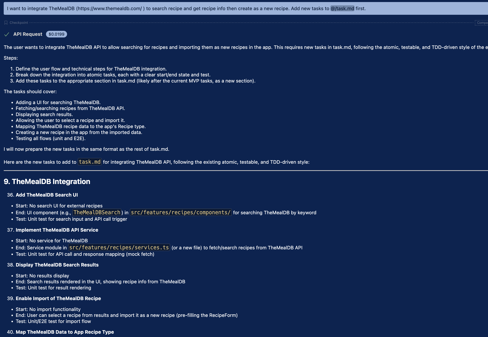
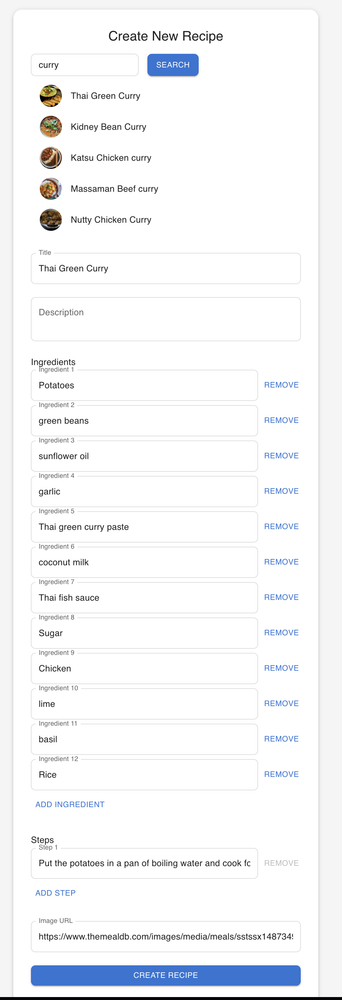
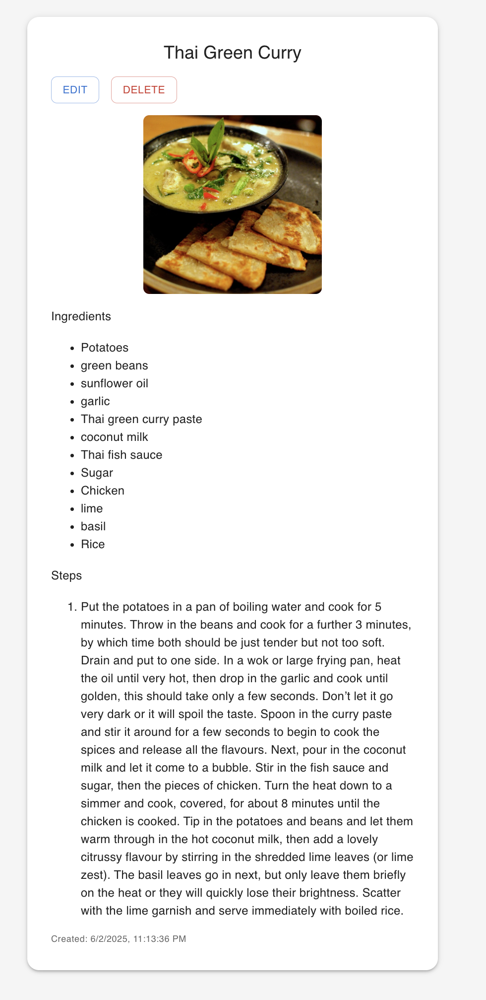

# UI and Layout

## Overview

In this chapter, you will experience how an AI agent can build a fully functional external API client with minimal guidance—if the target API is well-structured. You’ll integrate [TheMealDB](https://www.themealdb.com/), a public recipe API, to allow users to search for external recipes and import them into your application as new entries.

This exercise shows how an AI agent can leverage a small amount of context to produce a mature integration. It also highlights the importance of API quality—if the API is stable and well-documented, the AI can perform most of the implementation using the **Loop without human interaction** pattern. If not, you’ll need to step in with additional API details or corrections.

By the end of this chapter, your app will be able to import real-world recipe data with just a few user actions.


## 9-1 Implement external API client

Open a new Cline task, then start by running the following Plan-mode prompt:

```
You're an engineer building this codebase.

You've been given .clinerules/01_architecture.md and task.md

- Read both carefully. There should be no ambiguity about what we're building.
- Follow task.md and complete one task at a time.
- After each task, stop. I'll test it. If it works, commit to git and move to the next.


### CODING PROTOCOL ###
Read .clinerules/02_coding_policy.md as Coding Instructions
```

Next, prompt the AI to plan the integration of TheMealDB:

```
I want to integrate TheMealDB (https://www.themealdb.com/ ) to search recipe and get recipe info then create as a new recipe.  Add new tasks to @/task.md  first.
```

Cline will respond by generating a structured set of tasks and appending them to your task list. Here's an example of what it might generate:




<details>
<summary>New task example</summary>

```
## 9. Use TheMealDB 

36. **Add TheMealDB Search UI**
    - Start: No search UI for external recipes
    - End: UI component (e.g., `TheMealDBSearch`) in `src/features/recipes/components/` for searching TheMealDB by keyword
    - Test: Unit test for search input and API call trigger

37. **Implement TheMealDB API Service**
    - Start: No service for TheMealDB
    - End: Service module in `src/features/recipes/services.ts` (or a new file) to fetch/search recipes from TheMealDB API
    - Test: Unit test for API call and response mapping (mock fetch)

38. **Display TheMealDB Search Results**
    - Start: No results display
    - End: Search results rendered in the UI, showing recipe info from TheMealDB
    - Test: Unit test for result rendering

39. **Enable Import of TheMealDB Recipe**
    - Start: No import functionality
    - End: User can select a recipe from results and import it as a new recipe (pre-filling the RecipeForm)
    - Test: Unit/E2E test for import flow

40. **Map TheMealDB Data to App Recipe Type**
    - Start: No mapping logic
    - End: Mapping function to convert TheMealDB recipe data to app's Recipe type (in `src/features/recipes/types.ts` or a helper)
    - Test: Unit test for mapping function

41. **Create Recipe from Imported Data**
    - Start: No creation from import
    - End: Imported recipe is saved to Supabase and appears in the app as a new recipe
    - Test: E2E test for full import-to-create flow

42. **Test and Polish TheMealDB Integration**
    - Start: Integration implemented
    - End: All flows (search, import, create) tested and UI/UX polished
    - Test: Unit/E2E test pass, visual/manual review
```
</details>

Once the task list is updated, instruct the AI to begin execution:

prompt

```
Execute tasks from 36 to 42.
```

Cline will begin implementing the complete flow—from search UI, to API calls, to pre-filling your existing recipe form with external data, and saving it into Supabase.

You can test the integration by searching for a recipe (e.g., "Curry"), viewing results, selecting one, and importing it into your app.






## Conclusion

In this chapter, you implemented a complete integration with an external API—TheMealDB—using AI to plan, code, and test each step. You saw how a well-structured API allowed the AI agent to operate independently across multiple tasks, requiring minimal intervention.

This experience demonstrates the real power of AI-assisted development: using structured context, an agent can expand your app’s capabilities dramatically—like importing real-world data—without writing everything by hand.

As you build more integrations in the future, remember that a clean API surface paired with clear intent and context allows AI to act like a true teammate—not just a code generator, but a systems integrator.
